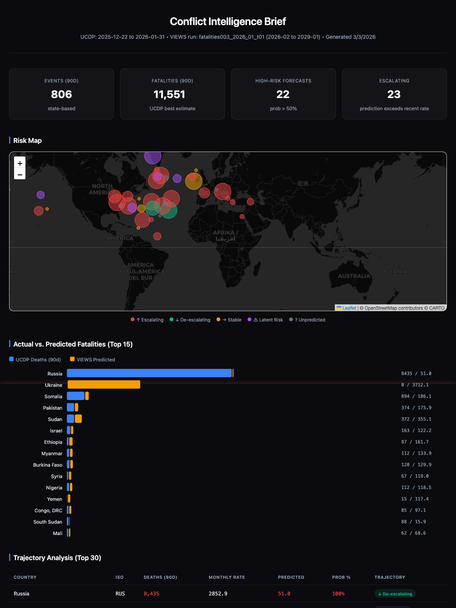
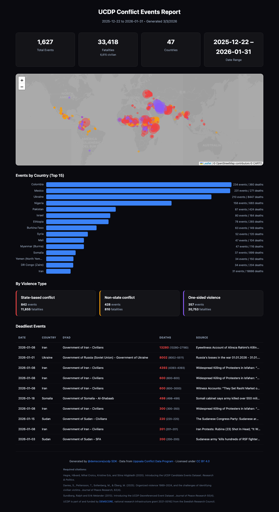
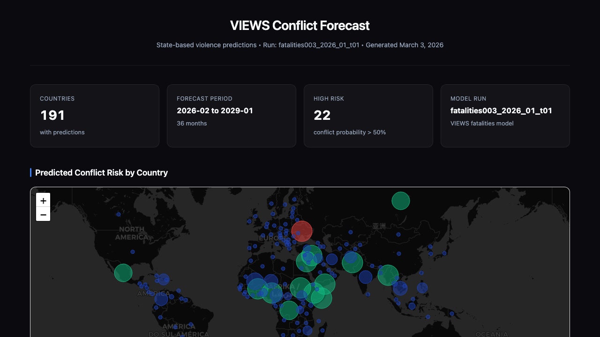

# Demscore Tools

TypeScript SDKs for conflict data and forecasting APIs from the [Demscore](https://demscore.com/) ecosystem.

## Packages

| Package | Description | Status |
|---------|-------------|--------|
| [`@demscore/ucdp`](packages/sdk) | TypeScript client for the [UCDP](https://ucdp.uu.se/) Conflict Data API | Beta |
| [`@demscore/views`](packages/views) | TypeScript client for the [VIEWS](https://viewsforecasting.org/) Forecasting API | Beta |
| [`@demscore/mcp-server`](packages/mcp-server) | MCP server for conflict data with anti-hallucination guardrails | Beta |
| [`@demscore/skill`](packages/skill) | Claude Code skill for responsible conflict data presentation | Beta |

## Quick Start — UCDP (What happened)

```typescript
import { UcdpClient } from "@demscore/ucdp";

const client = new UcdpClient({ token: "your-api-token" });

// Get the latest monthly conflict events (auto-probes version)
const { Result: events } = await client.getCandidateEvents({
    StartDate: "2025-01-01",
    TypeOfViolence: 1, // State-based conflicts
});

for (const event of events) {
    console.log(`${event.date_start} | ${event.country} | ${event.dyad_name} | ${event.best} deaths`);
}
```

## Quick Start — VIEWS (What's likely to happen)

```typescript
import { ViewsClient } from "@demscore/views";

const client = new ViewsClient();

// Get country-month conflict predictions (no auth required)
const response = await client.getCountryMonth({
    iso: ["SYR", "IRQ"],
});

for (const row of response.data) {
    console.log(`${row.name} (${row.year}-${row.month}): predictions available`);
}
```

## Demos

### Combined Conflict Intelligence Brief

Generate a combined report joining UCDP actuals with VIEWS forecasts for trajectory analysis:

```bash
cd demscore-tools
UCDP_TOKEN=your-token npx tsx demo/generate-combined-report.ts
```

This joins recent conflict events (last 90 days) with forward-looking fatality predictions (36 months) on Gleditsch-Ward country codes, classifying each situation as escalating, de-escalating, stable, latent risk, or unpredicted. The report includes a risk map, dual bar chart, trajectory table, and early warning panel.



### UCDP Conflict Events Report

Generate a visual HTML report from live UCDP conflict data:

```bash
cd demscore-tools
UCDP_TOKEN=your-token npx tsx demo/generate-report.ts
```

This fetches the last 90 days of GED Candidate events and generates an interactive report with a conflict map, country breakdown, and deadliest events table.



### VIEWS Conflict Forecast Report

Generate a conflict forecast report from VIEWS prediction data (no API token required):

```bash
cd demscore-tools
npx tsx demo/generate-views-report.ts
```

This discovers the latest VIEWS fatalities model run, fetches country-level state-based conflict predictions, and generates an interactive report with a risk map, top-20 bar chart, and forecast detail table.



## Anti-Hallucination Guardrails

This project implements defense-in-depth guardrails to prevent LLMs from misrepresenting conflict data and forecasts. Conflict fatalities data is sensitive — forecasts must not be presented as facts, and uncertainty ranges must never be stripped.

Three layers ensure caveats survive from API response to LLM-generated text:

- **SDK Envelopes** — `DataEnvelope<T>` wrappers carry provenance metadata, required citations, data-specific caveats, and interpretation notes alongside every query result
- **MCP Server** — Tool descriptions embed interpretation rules, prohibited language patterns, and required attribution that LLMs read at tool-discovery time
- **Skill Instructions** — 8 mandatory rules governing language, uncertainty reporting, citation, and data freshness

See [`docs/anti-hallucination-guardrails.md`](docs/anti-hallucination-guardrails.md) for the full design document with threat model and research references.

## UCDP API Access

Request an API token at the [UCDP API docs](https://ucdp.uu.se/apidocs/). Rate limit: 5,000 requests/day.

## VIEWS API Access

The VIEWS API is open access — no authentication required. See [viewsforecasting.org](https://viewsforecasting.org/).

## Data Attribution

UCDP datasets are licensed under [CC BY 4.0](https://creativecommons.org/licenses/by/4.0/). If you use data obtained through these SDKs, you must cite the relevant publications:

**UCDP Candidate Events Dataset:**
> Hegre, Håvard, Mihai Croicu, Kristine Eck, and Stina Högbladh (2020). Introducing the UCDP Candidate Events Dataset. *Research & Politics*.

**UCDP Georeferenced Event Dataset (GED):**
> Davies, S., Pettersson, T., Sollenberg, M., & Öberg, M. (2025). Organized violence 1989–2024, and the challenges of identifying civilian victims. *Journal of Peace Research*, 62(4).
>
> Sundberg, Ralph and Erik Melander (2013). Introducing the UCDP Georeferenced Event Dataset. *Journal of Peace Research* 50(4).

> UCDP is part of and funded by [DEMSCORE](https://demscore.com/), national research infrastructure grant 2021-00162 from the Swedish Research Council.

**VIEWS Forecasting System:**
> Hegre, Havard, et al. (2021). ViEWS2020: Revising and evaluating the ViEWS political violence early-warning system. *Journal of Peace Research* 58(3): 599-611.

## License

Code: MIT. Data: see [Data Attribution](#data-attribution) above.
